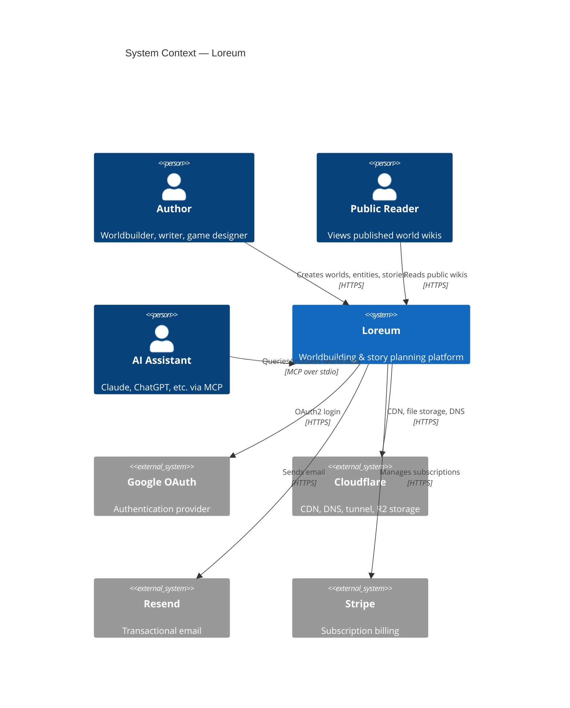
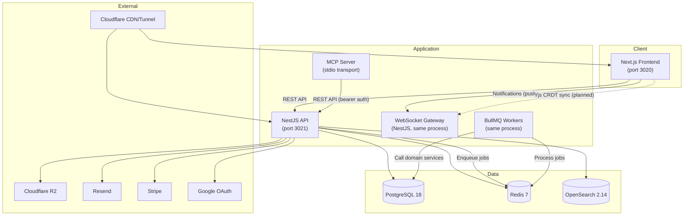
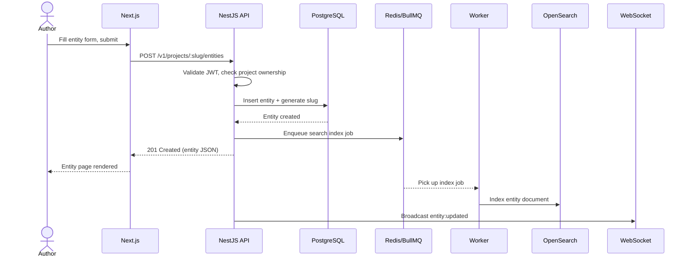
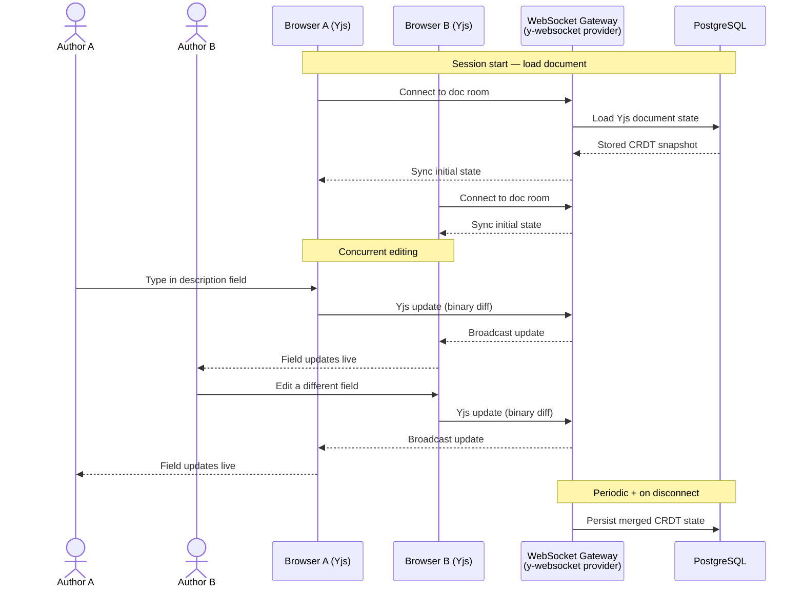
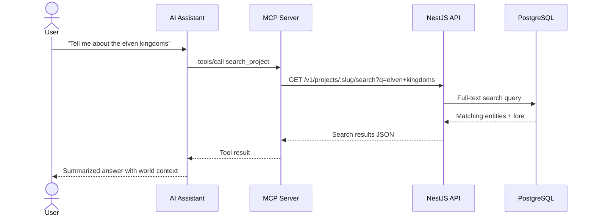
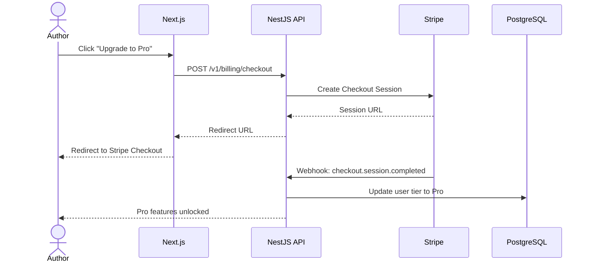
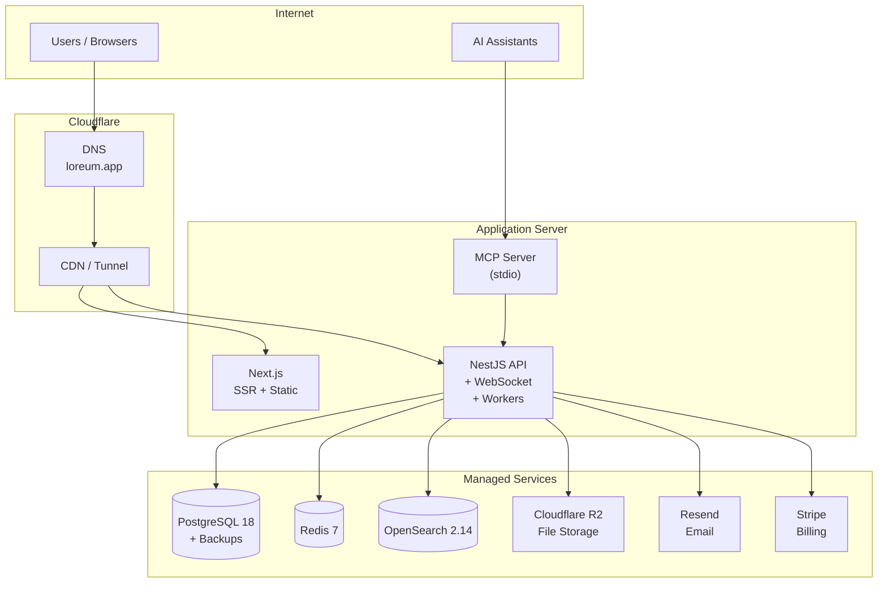

# System Architecture

High-level architecture diagrams and component descriptions for the Loreum platform.

---

## 1. System Context Diagram

External actors and how they interact with Loreum as a whole.



---

## 2. Component Diagram

Internal services and how they communicate.



### Component Responsibilities

| Component             | Role                                                                                                                                                                               |
| --------------------- | ---------------------------------------------------------------------------------------------------------------------------------------------------------------------------------- |
| **Next.js Frontend**  | SSR/CSR web app. Auth UI, project workspace, entity editor, relationship graph, timeline, storyboard.                                                                              |
| **NestJS API**        | REST API. Auth (Google OAuth + JWT), CRUD for all domain models, Swagger docs at `/docs`.                                                                                          |
| **WebSocket Gateway** | **Current:** one-way push notifications (entity/storyboard update events). **Planned:** bidirectional collaborative editing via Yjs CRDT provider. Runs inside the NestJS process. |
| **BullMQ Workers**    | Async job processing — search indexing, email dispatch, AI tasks. Centralized QueueModule; domain modules emit events, processors call domain services.                            |
| **MCP Server**        | Model Context Protocol server for AI assistants. Exposes tools (`search_project`, `get_entity`, `create_entity`, etc.) over stdio, proxying to the REST API with bearer auth.      |
| **PostgreSQL**        | Primary data store. Prisma ORM with migrations.                                                                                                                                    |
| **Redis**             | BullMQ job queue, session cache, rate limiting.                                                                                                                                    |
| **OpenSearch**        | Full-text search across entities, lore articles, timeline events.                                                                                                                  |

---

## 3. Data Flow Diagrams

### 3a. Entity Creation



### 3b. Real-Time Collaboration (Planned — Yjs)

Collaborative editing uses Yjs CRDTs over WebSocket. The Yjs document state lives in memory on the server while a session is active, and persists to PostgreSQL when the last client disconnects (or periodically). This is a separate concern from the notification events — both run over the same WebSocket connection but serve different purposes.



**Key design decisions:**

- **Yjs** handles conflict resolution — no OT server logic needed
- **y-websocket** provider on the NestJS gateway manages document rooms
- Each entity/lore article/scene is a separate Yjs document
- Rich text fields use Yjs bindings for the editor (TipTap + `y-prosemirror` or similar)
- Simple fields (name, tags) use `Y.Map` — last-write-wins is fine at field granularity
- Notification events (`entity:updated`, etc.) still fire for clients not in the editing session (dashboards, entity lists)

### 3c. AI Query via MCP



### 3d. Subscription Checkout (Planned)



---

## 4. Deployment Diagram



### Infrastructure Summary

| Layer           | Technology                | Notes                                                |
| --------------- | ------------------------- | ---------------------------------------------------- |
| **DNS + CDN**   | Cloudflare                | Tunnel for origin protection, R2 for file uploads    |
| **Frontend**    | Next.js 16                | Server-rendered, port 3020                           |
| **API**         | NestJS                    | REST + WebSocket + BullMQ workers, port 3021         |
| **MCP**         | @modelcontextprotocol/sdk | stdio transport, separate process                    |
| **Database**    | PostgreSQL 18             | Prisma ORM, single migration-managed schema          |
| **Cache/Queue** | Redis 7                   | BullMQ jobs, session store, rate limiting            |
| **Search**      | OpenSearch 2.14           | Full-text indexing of all content                    |
| **Storage**     | Cloudflare R2             | Entity images, file uploads                          |
| **Email**       | Resend                    | Invitations, notifications                           |
| **Billing**     | Stripe                    | Checkout sessions, webhooks, subscription management |

### Local Development

```sh
# Start infrastructure
docker compose up -d

# Start all apps
pnpm dev
```

This runs PostgreSQL, Redis, and OpenSearch in Docker. The API (3021), web app (3020), and MCP server run natively via Turborepo.
